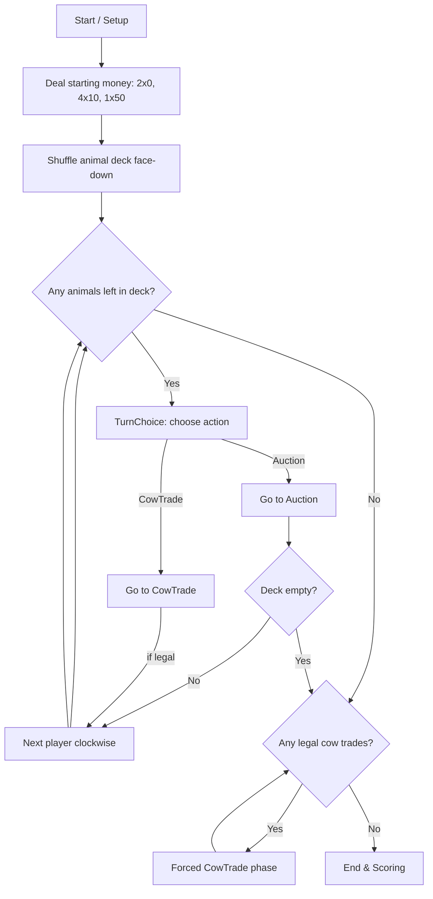
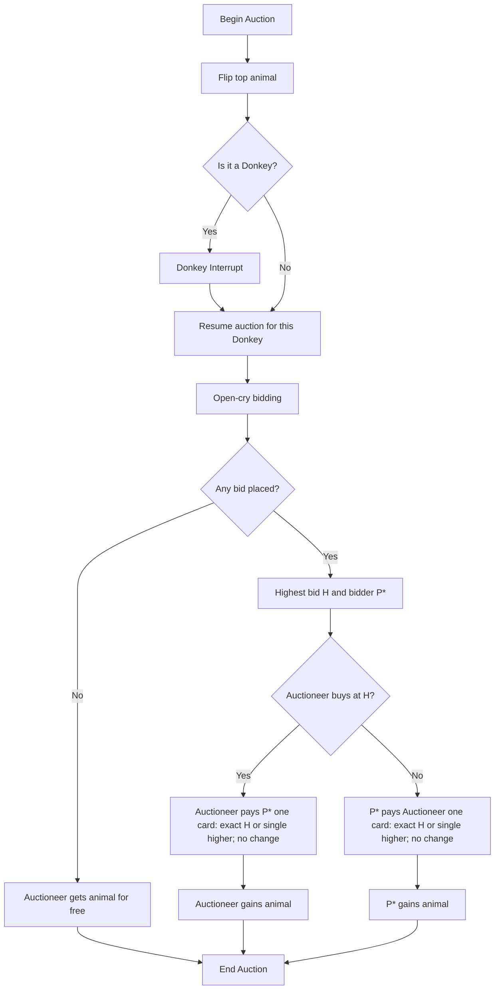
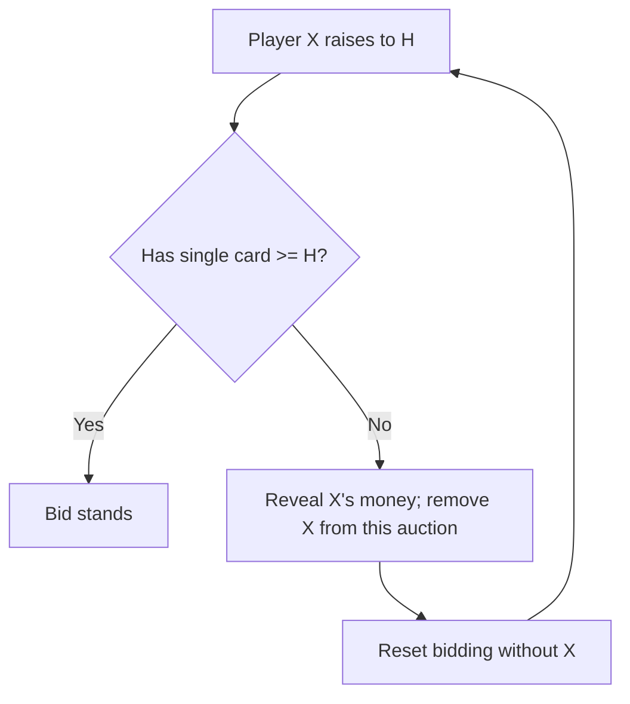
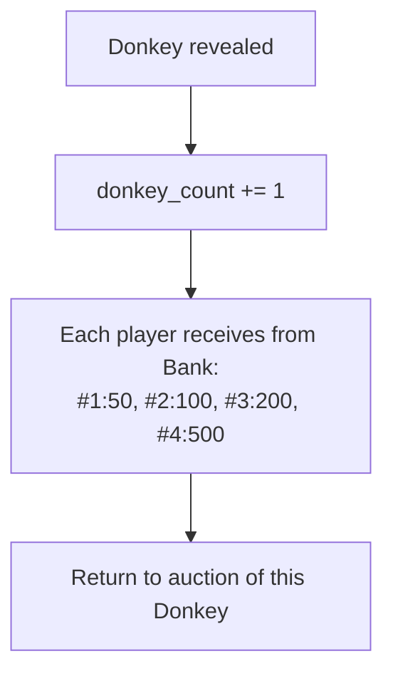
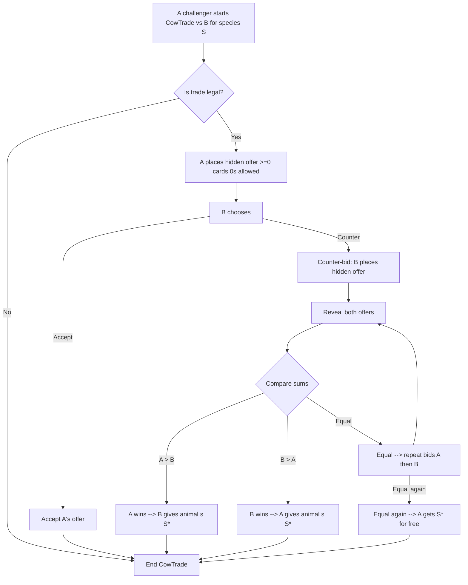
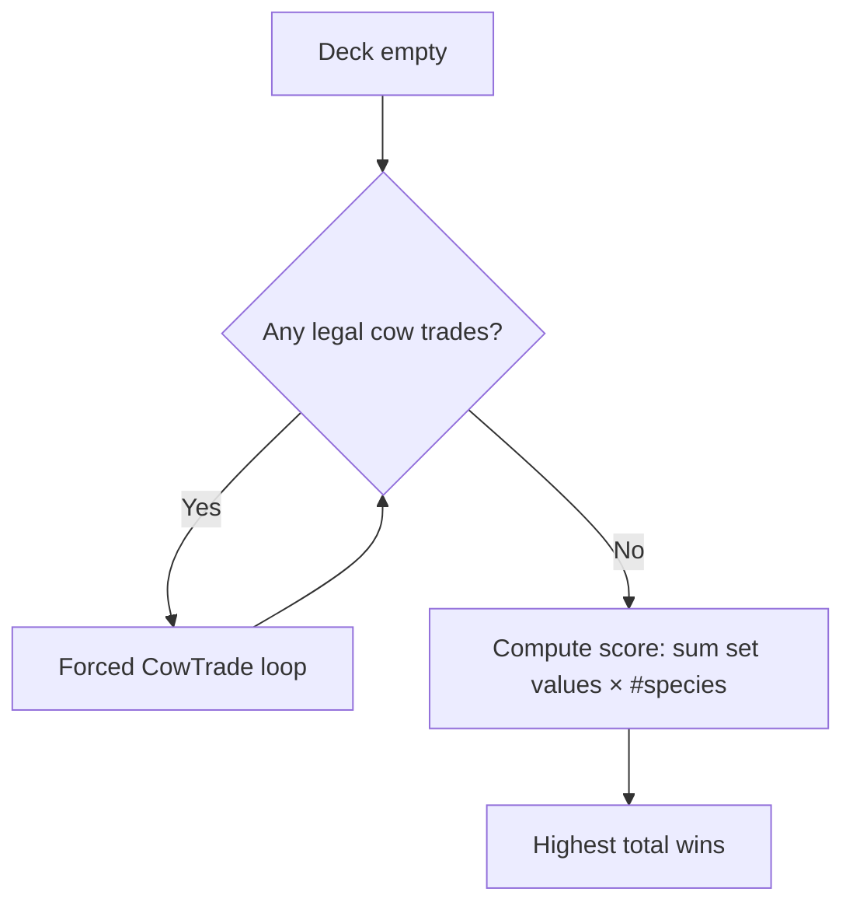

High level flowchart:

```mermaid
flowchart TD
start_setup[Start / Setup]
deal_money[Deal starting money: 2x0, 4x10, 1x50]
shuffle_deck[Shuffle animal deck face-down]
any_animals{Any animals left in deck?}
turn_choice[TurnChoice: choose action]
go_auction[Go to Auction]
go_trade[Go to CowTrade ]
post_auction_deck_empty{Deck empty?}
next_player[Next player clockwise]
any_trades{Any legal cow trades?}
forced_trade[Forced CowTrade phase]
end_scoring[End & Scoring]


start_setup --> deal_money --> shuffle_deck --> any_animals
any_animals -- Yes --> turn_choice
any_animals -- No --> any_trades
turn_choice -->|Auction| go_auction
turn_choice -->|CowTrade| go_trade
go_auction --> post_auction_deck_empty
post_auction_deck_empty -- No --> next_player --> any_animals
post_auction_deck_empty -- Yes --> any_trades
go_trade --if legal --> next_player --> any_animals
any_trades -- Yes --> forced_trade --> any_trades
any_trades -- No --> end_scoring
```

Auction

```mermaid
flowchart TD
a_start[Begin Auction] --> a_flip[Flip top animal]
a_is_donkey{Is it a Donkey?}
a_flip --> a_is_donkey
a_is_donkey -- Yes --> a_donkey_sub[Donkey Interrupt]
a_donkey_sub --> a_resume[Resume auction for this Donkey]
a_is_donkey -- No --> a_resume
a_resume --> a_bid[Open-cry bidding]
a_bid --> a_any_bid{Any bid placed?}
a_any_bid -- No --> a_free[Auctioneer gets animal for free]
a_any_bid -- Yes --> a_highest[Highest bid H and bidder P*]
a_highest --> a_auct_buy{Auctioneer buys at H?}
a_auct_buy -- Yes --> a_pay1[Auctioneer pays P* one card: exact H or single higher; no change]
a_pay1 --> a_gain1[Auctioneer gains animal]
a_auct_buy -- No --> a_pay2[P* pays Auctioneer one card: exact H or single higher; no change]
a_pay2 --> a_gain2[P* gains animal]
a_free --> a_end[End Auction]
a_gain1 --> a_end
a_gain2 --> a_end
```

Bid Validation & Exclusion Loop

```mermaid
flowchart TD
b_new[Player X raises to H] --> b_canpay{Has single card >= H?}
b_canpay -- Yes --> b_ok[Bid stands]
b_canpay -- No --> b_kick[Reveal X's money; remove X from this auction]
b_kick --> b_reset[Reset bidding without X]
b_reset --> b_new
```

Donkey Interrupt

```mermaid
flowchart TD
d_rev[Donkey revealed] --> d_cnt[donkey_count += 1]
d_cnt --> d_pay[Each player receives from Bank:
#1:50, #2:100, #3:200, #4:500]
d_pay --> d_back[Return to auction of this Donkey]
```

trade

```mermaid
flowchart TD
ct_start[A challenger starts CowTrade vs B for species S]
ct_legal{Is trade legal?}
ct_offerA[A places hidden offer >=0 cards 0s allowed]
ct_choice[B chooses]
ct_accept[Accept A's offer]
ct_counter[Counter-bid: B places hidden offer]
ct_reveal[Reveal both offers]
ct_cmp{Compare sums}
ct_Awins[A wins --> B gives animal s S*]
ct_Bwins[B wins --> A gives animal s S*]
ct_tie1[Equal --> repeat bids A then B]
ct_tie2[Equal again --> A gets S* for free]
ct_done[End CowTrade]


ct_start --> ct_legal
ct_legal -- No --> ct_done
ct_legal -- Yes --> ct_offerA --> ct_choice
ct_choice -->|Accept| ct_accept --> ct_done
ct_choice -->|Counter| ct_counter --> ct_reveal --> ct_cmp
ct_cmp -- A > B --> ct_Awins --> ct_done
ct_cmp -- B > A --> ct_Bwins --> ct_done
ct_cmp -- Equal --> ct_tie1 --> ct_reveal
ct_tie1 -- Equal again --> ct_tie2 --> ct_done
```

end

```mermaid
flowchart TD
e_deck_empty[Deck empty] --> e_any_trades{Any legal cow trades?}
e_any_trades -- Yes --> e_force[Forced CowTrade loop]
e_force --> e_any_trades
e_any_trades -- No --> e_score[Compute score: sum set values × #species]
e_score --> e_winner[Highest total wins]
```